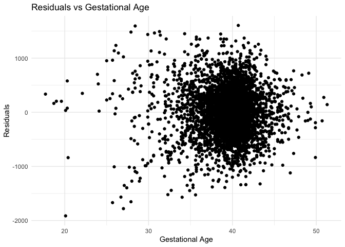

p8105_hw6_yx2954
================
Yiran Xu
2024-11-28

``` r
library(tidyverse)
```

    ## ── Attaching core tidyverse packages ──────────────────────── tidyverse 2.0.0 ──
    ## ✔ dplyr     1.1.4     ✔ readr     2.1.5
    ## ✔ forcats   1.0.0     ✔ stringr   1.5.1
    ## ✔ ggplot2   3.5.1     ✔ tibble    3.2.1
    ## ✔ lubridate 1.9.3     ✔ tidyr     1.3.1
    ## ✔ purrr     1.0.2     
    ## ── Conflicts ────────────────────────────────────────── tidyverse_conflicts() ──
    ## ✖ dplyr::filter() masks stats::filter()
    ## ✖ dplyr::lag()    masks stats::lag()
    ## ℹ Use the conflicted package (<http://conflicted.r-lib.org/>) to force all conflicts to become errors

``` r
library(modelr)
library(p8105.datasets)
library(mgcv)
```

    ## Loading required package: nlme
    ## 
    ## Attaching package: 'nlme'
    ## 
    ## The following object is masked from 'package:dplyr':
    ## 
    ##     collapse
    ## 
    ## This is mgcv 1.9-1. For overview type 'help("mgcv-package")'.

# Problem 1

Load data

``` r
weather_df = 
  rnoaa::meteo_pull_monitors(
    c("USW00094728"),
    var = c("PRCP", "TMIN", "TMAX"), 
    date_min = "2017-01-01",
    date_max = "2017-12-31") %>%
  mutate(
    name = recode(id, USW00094728 = "CentralPark_NY"),
    tmin = tmin / 10,
    tmax = tmax / 10) %>%
  select(name, id, everything())
```

    ## using cached file: /Users/yiran/Library/Caches/org.R-project.R/R/rnoaa/noaa_ghcnd/USW00094728.dly

    ## date created (size, mb): 2024-09-26 10:30:53.28184 (8.651)

    ## file min/max dates: 1869-01-01 / 2024-09-30

Create and apply bootstrap generating function

``` r
boot_sample <- function(df) {
  sample_frac(df, replace = TRUE)
}
```

We should also do a quick check to see if this is working.

``` r
set.seed(456)

boot_sample(weather_df) |> 
  ggplot(aes(x = tmin, y = tmax)) + 
  geom_point(alpha = .5) +
  stat_smooth(method = "lm")
```

    ## `geom_smooth()` using formula = 'y ~ x'

<!-- -->

That looks about right. Then we generate 5,000 bootstrap samples

``` r
boot_straps = tibble(strap_number = 1:5000) |>
  mutate(
    strap_sample = map(strap_number, \(i) boot_sample(df = weather_df))
  )
```

``` r
bootstrap_results <- boot_straps |>
  mutate(
    models = map(strap_sample, \(df) lm(tmax ~ tmin, data = df)),
    r2 = map_dbl(models, \(model) broom::glance(model)$r.squared),
    log_beta0_beta1 = map_dbl(models, \(model) {
      coefs <- broom::tidy(model)$estimate
      log(coefs[1] * coefs[2])
    })
  ) |>
  select(-strap_sample, -models) |>
  unnest(log_beta0_beta1) 
```

Plot the distribution of two sample estimates

``` r
bootstrap_longer = bootstrap_results |>
  pivot_longer(
    cols = c(r2, log_beta0_beta1),
    names_to = "statistic",
    values_to = "value"
  )

estimate_plot = bootstrap_longer |>
  ggplot(aes(x = value)) +
  geom_density(alpha = 0.5, fill = "blue") +
  facet_wrap(~statistic, scales = "free", labeller = labeller(
    statistic = c(
      r2 = "R^2",
      log_beta0_beta1 = "log(β0 * β1)"
    )
  )) +
  labs(
    title = "Bootstrap Distributions",
    x = "Value",
    y = "Density"
  )

print(estimate_plot)
```

<!-- -->

Get numeric values of sample estimates

``` r
bootstrap_summary <- bootstrap_results %>%
  summarize(
    r2_mean = mean(r2),
    r2_sd = sd(r2),
    log_beta0_beta1_mean = mean(log_beta0_beta1),
    log_beta0_beta1_sd = sd(log_beta0_beta1)
  )
```

The plot shows that both sample estimates are nearly normally
distributed. The sample mean of log(beta0 \* beta1) is 2.013649 and
standard error is 0.02389236. The maen of r2 is 0.9114209 and the
standard error is 0.00849257.

Get CI for both sample estimates

``` r
ci_r2 = quantile(bootstrap_results$r2, c(0.025, 0.975))
ci_log_beta0_beta1 <- quantile(bootstrap_results$log_beta0_beta1, c(0.025, 0.975))
```

The 95% CI of r2 is (0.8940791, 0.9271204), the 95% CI of log(beta0 \*
beta1) is (1.964630, 2.058959)

# Problem 2

Load data and data cleaning

``` r
homicide_df <- read_csv("https://raw.githubusercontent.com/washingtonpost/data-homicides/master/homicide-data.csv") 
```

    ## Rows: 52179 Columns: 12
    ## ── Column specification ────────────────────────────────────────────────────────
    ## Delimiter: ","
    ## chr (9): uid, victim_last, victim_first, victim_race, victim_age, victim_sex...
    ## dbl (3): reported_date, lat, lon
    ## 
    ## ℹ Use `spec()` to retrieve the full column specification for this data.
    ## ℹ Specify the column types or set `show_col_types = FALSE` to quiet this message.

``` r
homicide_df = homicide_df |>
  mutate(city_state = paste(city, state, sep = ", "),
         status = if_else(disposition == "Closed by arrest", 1, 0)
           ) |>  
  filter(
    !city_state %in% c("Dallas, TX", "Phoenix, AZ", "Kansas City, MO", "Tulsa, AL"),
    victim_race %in% c("White", "Black"),
    victim_age != "Unknown") |>
  mutate(victim_age = as.numeric(victim_age)) |>
  select(-city, - state, -disposition)
```

Logistic regression in Baltimore, MD

``` r
baltimore_df = homicide_df |>
  filter(city_state == "Baltimore, MD")

baltimore_glm = glm(status ~ victim_age + victim_sex + victim_race,
                     data = baltimore_df,
                     family = binomial()) |>
  broom::tidy(exponentiate = TRUE, conf.int = TRUE)

baltimore_or = baltimore_glm |>
  filter(term == "victim_sexMale") |>
  select(term, estimate, conf.low, conf.high) |>
  knitr::kable(digits = 4)
```

The Odd ratio for solving homicides comparing male victims to female
victims is 0.4255, with a 95% CI of (0.3242, 0.5576) and p value =
6.255119e-10. It suggests that the result is significant as the higher
boundary is smaller than 1, and the probability of solving homicides of
male victims is 42.6% as likely as that of female victims.

Run glm for each of the cities

``` r
all_city_results = homicide_df |>
  group_by(city_state) |>
  nest() |>
  mutate(
    glm_model = map(data, ~ glm(status ~ victim_age + victim_sex + victim_race, data = ., family = binomial())),
    tidy_model = map(glm_model, ~ broom::tidy(.x, exponentiate = TRUE, conf.int = TRUE))
  ) |>
  unnest(tidy_model) |>
  filter(term == "victim_sexMale") %>%
  select(city_state, estimate, conf.low, conf.high) |>
  arrange(estimate) 
```

    ## Warning: There were 44 warnings in `mutate()`.
    ## The first warning was:
    ## ℹ In argument: `tidy_model = map(glm_model, ~broom::tidy(.x, exponentiate =
    ##   TRUE, conf.int = TRUE))`.
    ## ℹ In group 1: `city_state = "Albuquerque, NM"`.
    ## Caused by warning:
    ## ! glm.fit: fitted probabilities numerically 0 or 1 occurred
    ## ℹ Run `dplyr::last_dplyr_warnings()` to see the 43 remaining warnings.

``` r
all_city_results |>
  knitr::kable(digits = 4)
```

| city_state         | estimate | conf.low | conf.high |
|:-------------------|---------:|---------:|----------:|
| New York, NY       |   0.2624 |   0.1328 |    0.4850 |
| Baton Rouge, LA    |   0.3814 |   0.2043 |    0.6836 |
| Omaha, NE          |   0.3825 |   0.1988 |    0.7109 |
| Cincinnati, OH     |   0.3998 |   0.2314 |    0.6670 |
| Chicago, IL        |   0.4101 |   0.3361 |    0.5009 |
| Long Beach, CA     |   0.4102 |   0.1427 |    1.0242 |
| San Diego, CA      |   0.4130 |   0.1914 |    0.8302 |
| Baltimore, MD      |   0.4255 |   0.3242 |    0.5576 |
| Pittsburgh, PA     |   0.4308 |   0.2626 |    0.6956 |
| Denver, CO         |   0.4791 |   0.2327 |    0.9625 |
| Louisville, KY     |   0.4906 |   0.3015 |    0.7836 |
| Philadelphia, PA   |   0.4963 |   0.3760 |    0.6499 |
| San Bernardino, CA |   0.5003 |   0.1655 |    1.4624 |
| Miami, FL          |   0.5152 |   0.3040 |    0.8734 |
| Buffalo, NY        |   0.5206 |   0.2884 |    0.9358 |
| Columbus, OH       |   0.5325 |   0.3770 |    0.7479 |
| Oakland, CA        |   0.5631 |   0.3637 |    0.8671 |
| Detroit, MI        |   0.5823 |   0.4619 |    0.7335 |
| New Orleans, LA    |   0.5849 |   0.4219 |    0.8122 |
| San Francisco, CA  |   0.6075 |   0.3117 |    1.1551 |
| Los Angeles, CA    |   0.6619 |   0.4565 |    0.9541 |
| Sacramento, CA     |   0.6688 |   0.3263 |    1.3144 |
| Fort Worth, TX     |   0.6690 |   0.3935 |    1.1212 |
| Boston, MA         |   0.6740 |   0.3534 |    1.2768 |
| Washington, DC     |   0.6902 |   0.4654 |    1.0123 |
| St. Louis, MO      |   0.7032 |   0.5299 |    0.9319 |
| San Antonio, TX    |   0.7046 |   0.3928 |    1.2383 |
| Houston, TX        |   0.7110 |   0.5570 |    0.9057 |
| Jacksonville, FL   |   0.7198 |   0.5359 |    0.9651 |
| Memphis, TN        |   0.7232 |   0.5261 |    0.9836 |
| Milwaukee, wI      |   0.7271 |   0.4951 |    1.0542 |
| Tampa, FL          |   0.8077 |   0.3395 |    1.8599 |
| Durham, NC         |   0.8124 |   0.3824 |    1.6580 |
| Las Vegas, NV      |   0.8373 |   0.6059 |    1.1511 |
| Savannah, GA       |   0.8670 |   0.4186 |    1.7802 |
| Birmingham, AL     |   0.8700 |   0.5714 |    1.3138 |
| Charlotte, NC      |   0.8839 |   0.5507 |    1.3906 |
| Indianapolis, IN   |   0.9187 |   0.6785 |    1.2413 |
| Minneapolis, MN    |   0.9470 |   0.4759 |    1.8810 |
| Oklahoma City, OK  |   0.9741 |   0.6229 |    1.5200 |
| Tulsa, OK          |   0.9758 |   0.6091 |    1.5439 |
| Atlanta, GA        |   1.0001 |   0.6803 |    1.4583 |
| Richmond, VA       |   1.0061 |   0.4835 |    1.9936 |
| Nashville, TN      |   1.0342 |   0.6807 |    1.5560 |
| Fresno, CA         |   1.3352 |   0.5673 |    3.0475 |
| Stockton, CA       |   1.3517 |   0.6256 |    2.9941 |
| Albuquerque, NM    |   1.7675 |   0.8247 |    3.7619 |

Create a plot that shows the estimated ORs and CIs for each city.

``` r
all_city_plot = all_city_results |>
  ggplot(aes(x = reorder(city_state, estimate), y = estimate)) +
  geom_point(size = 3) +
  geom_errorbar(aes(ymin = conf.low, ymax = conf.high), width = 0.2) +
  coord_flip() +
  labs(
    title = "Adjusted Odds Ratios for Solving Homicides (Male vs Female)",
    x = "City",
    y = "Odds Ratio",
  ) +
  theme_minimal()

print(all_city_plot)
```

<!-- -->

Comments: This plot displays the adjusted odds ratios (OR) for solving
homicides for male victims compared to female victims across various
cities, while controlling for other factors. An OR greater than 1
indicates a higher likelihood of resolution for male victims, while an
OR less than 1 suggests the opposite.

Among all cities included, Albuquerque, NM has the highest adjusted OR,
indicating highest proportion of solving male homicides. But its 95% CI
is very broad, suggesting the uncertainty of estimate caused by limited
sample size. New York, NY has the lowest adjusted OR, suggesting the
highest proportion of solving female homicides. 41 cities have an
adjusted OR less than 1, while 6 cities have an adjusted OR larger than
1.

# Problem 3

Load and clean data

``` r
bw_df = read_csv("https://p8105.com/data/birthweight.csv") |>
  mutate(
      babysex = recode_factor(babysex, `1` = "Male", `2` = "Female"), 
      frace = recode_factor(frace, `1` = "White", `2` = "Black", `3` = "Asian", 
                                   `4` = "Puerto Rican", `8` = "Other", `9` = "Unknown"),
      mrace = recode_factor(mrace, `1` = "White", `2` = "Black", `3` = "Asian", 
                                   `4` = "Puerto Rican", `8` = "Other"), 
      malform = recode_factor(malform, `0` = "Absent", `1` = "Present"), 
  )
```

    ## Rows: 4342 Columns: 20
    ## ── Column specification ────────────────────────────────────────────────────────
    ## Delimiter: ","
    ## dbl (20): babysex, bhead, blength, bwt, delwt, fincome, frace, gaweeks, malf...
    ## 
    ## ℹ Use `spec()` to retrieve the full column specification for this data.
    ## ℹ Specify the column types or set `show_col_types = FALSE` to quiet this message.

``` r
sapply(bw_df, function(x) sum(is.na(x)))
```

    ##  babysex    bhead  blength      bwt    delwt  fincome    frace  gaweeks 
    ##        0        0        0        0        0        0        0        0 
    ##  malform menarche  mheight   momage    mrace   parity  pnumlbw  pnumsga 
    ##        0        0        0        0        0        0        0        0 
    ##    ppbmi     ppwt   smoken   wtgain 
    ##        0        0        0        0

``` r
summary(bw_df)
```

    ##    babysex         bhead          blength           bwt           delwt      
    ##  Male  :2230   Min.   :21.00   Min.   :20.00   Min.   : 595   Min.   : 86.0  
    ##  Female:2112   1st Qu.:33.00   1st Qu.:48.00   1st Qu.:2807   1st Qu.:131.0  
    ##                Median :34.00   Median :50.00   Median :3132   Median :143.0  
    ##                Mean   :33.65   Mean   :49.75   Mean   :3114   Mean   :145.6  
    ##                3rd Qu.:35.00   3rd Qu.:51.00   3rd Qu.:3459   3rd Qu.:157.0  
    ##                Max.   :41.00   Max.   :63.00   Max.   :4791   Max.   :334.0  
    ##     fincome               frace         gaweeks         malform    
    ##  Min.   : 0.00   White       :2123   Min.   :17.70   Absent :4327  
    ##  1st Qu.:25.00   Black       :1911   1st Qu.:38.30   Present:  15  
    ##  Median :35.00   Asian       :  46   Median :39.90                 
    ##  Mean   :44.11   Puerto Rican: 248   Mean   :39.43                 
    ##  3rd Qu.:65.00   Other       :  14   3rd Qu.:41.10                 
    ##  Max.   :96.00                       Max.   :51.30                 
    ##     menarche        mheight          momage              mrace     
    ##  Min.   : 0.00   Min.   :48.00   Min.   :12.0   White       :2147  
    ##  1st Qu.:12.00   1st Qu.:62.00   1st Qu.:18.0   Black       :1909  
    ##  Median :12.00   Median :63.00   Median :20.0   Asian       :  43  
    ##  Mean   :12.51   Mean   :63.49   Mean   :20.3   Puerto Rican: 243  
    ##  3rd Qu.:13.00   3rd Qu.:65.00   3rd Qu.:22.0                      
    ##  Max.   :19.00   Max.   :77.00   Max.   :44.0                      
    ##      parity            pnumlbw     pnumsga      ppbmi            ppwt      
    ##  Min.   :0.000000   Min.   :0   Min.   :0   Min.   :13.07   Min.   : 70.0  
    ##  1st Qu.:0.000000   1st Qu.:0   1st Qu.:0   1st Qu.:19.53   1st Qu.:110.0  
    ##  Median :0.000000   Median :0   Median :0   Median :21.03   Median :120.0  
    ##  Mean   :0.002303   Mean   :0   Mean   :0   Mean   :21.57   Mean   :123.5  
    ##  3rd Qu.:0.000000   3rd Qu.:0   3rd Qu.:0   3rd Qu.:22.91   3rd Qu.:134.0  
    ##  Max.   :6.000000   Max.   :0   Max.   :0   Max.   :46.10   Max.   :287.0  
    ##      smoken           wtgain      
    ##  Min.   : 0.000   Min.   :-46.00  
    ##  1st Qu.: 0.000   1st Qu.: 15.00  
    ##  Median : 0.000   Median : 22.00  
    ##  Mean   : 4.145   Mean   : 22.08  
    ##  3rd Qu.: 5.000   3rd Qu.: 28.00  
    ##  Max.   :60.000   Max.   : 89.00

Then build my model:

Model Hypothesis: Based on empirical knowledge, birth weight may be
related to pre-pregnant weight and gestational age in weeks. But as we
don’t know if this relationship is linear, I apply gam model instead of
lm. The interaction between them are not considered. Here is my model:

``` r
fit_hypothetical = gam(bwt ~ s(ppwt) + s(gaweeks), data = bw_df)
```

``` r
bw_df = bw_df |>
  modelr::add_predictions(fit_hypothetical) |>
  modelr::add_residuals(fit_hypothetical)
```

``` r
bw_df |> 
  modelr::add_residuals(fit_hypothetical) |> 
  ggplot(aes(x = gaweeks, y = resid)) + geom_point() + 
  labs(
    x = "Gestational Age", 
    y = "Residuals",
    title = "Residuals vs Gestational Age"
  ) +
  theme_minimal()
```

<!-- -->

``` r
bw_df |> 
  modelr::add_residuals(fit_hypothetical) |> 
  ggplot(aes(x = ppwt, y = resid)) +
  geom_point() +
  labs(
    x = "Pre-pregnancy Weight (ppwt)", 
    y = "Residuals",
    title = "Residuals vs Pre-pregnancy Weight"
  ) +
  theme_minimal()
```

<figure>

<figcaption aria-hidden="true">residuals_vs_ppwt</figcaption>
</figure>

``` r
residuals_hypothetical = residuals(fit_hypothetical)

qqnorm(residuals_hypothetical, main = "QQ Plot of Residuals")
qqline(residuals_hypothetical, col = "red", lwd = 2)
```

<!-- --> The
qq plot shows that the residuals are approximately approach normal
distribution. At the extreme ends, there are noticeable deviations from
the red line. This suggests that the model might not fully capture the
data’s behavior for observations with extreme values.

## Then comparing my models to the other two models:

First generate train set and test set:

``` r
set.seed(123)

cv_df = crossv_mc(bw_df, 100) |>
  mutate(
    train = map(train, as_tibble),
    test = map(test, as_tibble)
  )
```

Then do the same using the other two models:

``` r
cv_results = cv_df |>
  mutate(
    my_model = map(train, ~ gam(bwt ~ s(ppwt) + s(gaweeks), data = .x)),
    model_2 = map(train, ~ lm(bwt ~ blength + gaweeks, data = .x)),
    model_3 = map(train, ~ lm(bwt ~ bhead * blength * babysex, data = .x))
  ) |>
  mutate(
    rmse_model_2 = map2_dbl(model_2, test, ~ rmse(model = .x, data = .y)),
    rmse_model_3 = map2_dbl(model_3, test, ~ rmse(model = .x, data = .y)),
    rmse_my_model = map2_dbl(my_model, test, ~ rmse(model = .x, data = .y))
  )
```

``` r
cv_results |>
  select(starts_with("rmse")) |>
  pivot_longer(
    cols = everything(),
    names_to = "model",
    values_to = "rmse",
    names_prefix = "rmse_"
  ) |>
  mutate(model = fct_inorder(model)) %>%
  ggplot(aes(x = model, y = rmse)) +
  geom_violin() +
  labs(
    title = "Cross-Validated RMSE Comparison",
    x = "Model",
    y = "RMSE"
  ) +
  theme_minimal()
```

<!-- -->

From the figure above, my model is not as good as the other two models
in terms of the value of RMSE. This might because that the two factors I
chose are not the key factors that capture the major variance of the
data. The interaction model is the best in terms of RMSE, but should
also consider the model complexity by adding an additional factor.
