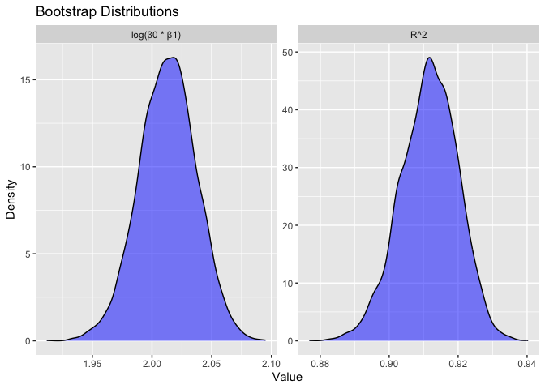

p8105_hw6_yx2954
================
Yiran Xu
2024-11-28

``` r
library(tidyverse)
```

    ## ── Attaching core tidyverse packages ──────────────────────── tidyverse 2.0.0 ──
    ## ✔ dplyr     1.1.4     ✔ readr     2.1.5
    ## ✔ forcats   1.0.0     ✔ stringr   1.5.1
    ## ✔ ggplot2   3.5.1     ✔ tibble    3.2.1
    ## ✔ lubridate 1.9.3     ✔ tidyr     1.3.1
    ## ✔ purrr     1.0.2     
    ## ── Conflicts ────────────────────────────────────────── tidyverse_conflicts() ──
    ## ✖ dplyr::filter() masks stats::filter()
    ## ✖ dplyr::lag()    masks stats::lag()
    ## ℹ Use the conflicted package (<http://conflicted.r-lib.org/>) to force all conflicts to become errors

``` r
library(p8105.datasets)
```

# Problem 1

Load data

``` r
weather_df = 
  rnoaa::meteo_pull_monitors(
    c("USW00094728"),
    var = c("PRCP", "TMIN", "TMAX"), 
    date_min = "2017-01-01",
    date_max = "2017-12-31") %>%
  mutate(
    name = recode(id, USW00094728 = "CentralPark_NY"),
    tmin = tmin / 10,
    tmax = tmax / 10) %>%
  select(name, id, everything())
```

    ## using cached file: /Users/yiran/Library/Caches/org.R-project.R/R/rnoaa/noaa_ghcnd/USW00094728.dly

    ## date created (size, mb): 2024-09-26 10:30:53.28184 (8.651)

    ## file min/max dates: 1869-01-01 / 2024-09-30

Create and apply bootstrap generating function

``` r
boot_sample <- function(df) {
  sample_frac(df, replace = TRUE)
}
```

We should also do a quick check to see if this is working.

``` r
boot_sample(weather_df) |> 
  ggplot(aes(x = tmin, y = tmax)) + 
  geom_point(alpha = .5) +
  stat_smooth(method = "lm")
```

    ## `geom_smooth()` using formula = 'y ~ x'

<figure>

<figcaption aria-hidden="true">bootstrap_sample_check</figcaption>
</figure>

That looks about right. Then we generate 5,000 bootstrap samples

``` r
boot_straps = tibble(strap_number = 1:5000) |>
  mutate(
    strap_sample = map(strap_number, \(i) boot_sample(df = weather_df))
  )
```

``` r
bootstrap_results <- boot_straps |>
  mutate(
    models = map(strap_sample, \(df) lm(tmax ~ tmin, data = df)),
    r2 = map_dbl(models, \(model) broom::glance(model)$r.squared),
    log_beta0_beta1 = map_dbl(models, \(model) {
      coefs <- broom::tidy(model)$estimate
      log(coefs[1] * coefs[2])
    })
  ) |>
  select(-strap_sample, -models) |>
  unnest(log_beta0_beta1) 
```

Plot the distribution of two sample estimates

``` r
bootstrap_longer = bootstrap_results |>
  pivot_longer(
    cols = c(r2, log_beta0_beta1),
    names_to = "statistic",
    values_to = "value"
  )

estimate_plot = bootstrap_longer |>
  ggplot(aes(x = value)) +
  geom_density(alpha = 0.5, fill = "blue") +
  facet_wrap(~statistic, scales = "free", labeller = labeller(
    statistic = c(
      r2 = "R^2",
      log_beta0_beta1 = "log(β0 * β1)"
    )
  )) +
  labs(
    title = "Bootstrap Distributions",
    x = "Value",
    y = "Density"
  )

print(estimate_plot)
```

<figure>

<figcaption aria-hidden="true">estimate_plot</figcaption>
</figure>

Get numeric values of sample estimates

``` r
bootstrap_summary <- bootstrap_results %>%
  summarize(
    r2_mean = mean(r2),
    r2_sd = sd(r2),
    log_beta0_beta1_mean = mean(log_beta0_beta1),
    log_beta0_beta1_sd = sd(log_beta0_beta1)
  )
```

The plot shows that both sample estimates are nearly normally
distributed. The sample mean of log(beta0 \* beta1) is 2.013649 and
standard error is 0.02389236. The maen of r2 is 0.9114209 and the
standard error is 0.00849257.

Get CI for both sample estimates

``` r
ci_r2 = quantile(bootstrap_results$r2, c(0.025, 0.975))
ci_log_beta0_beta1 <- quantile(bootstrap_results$log_beta0_beta1, c(0.025, 0.975))
```

The 95% CI of r2 is (0.8940791, 0.9271204), the 95% CI of log(beta0 \*
beta1) is (1.964630, 2.058959)

# Problem 2

Load data and data cleaning

``` r
homicide_df <- read_csv("https://raw.githubusercontent.com/washingtonpost/data-homicides/master/homicide-data.csv") 
```

    ## Rows: 52179 Columns: 12
    ## ── Column specification ────────────────────────────────────────────────────────
    ## Delimiter: ","
    ## chr (9): uid, victim_last, victim_first, victim_race, victim_age, victim_sex...
    ## dbl (3): reported_date, lat, lon
    ## 
    ## ℹ Use `spec()` to retrieve the full column specification for this data.
    ## ℹ Specify the column types or set `show_col_types = FALSE` to quiet this message.

``` r
homicide_df = homicide_df |>
  mutate(city_state = paste(city, state, sep = ", "),
         status = if_else(disposition == "Closed by arrest", 1, 0),
         victim_age = as.numeric(victim_age)
           ) |>  
  filter(
    !city_state %in% c("Dallas, TX", "Phoenix, AZ", "Kansas City, MO", "Tulsa, AL"),
    victim_race %in% c("White", "Black")) |>
  select(-city, - state, -disposition)
```

    ## Warning: There was 1 warning in `mutate()`.
    ## ℹ In argument: `victim_age = as.numeric(victim_age)`.
    ## Caused by warning:
    ## ! NAs introduced by coercion

Logistic regression in Baltimore, MD

``` r
baltimore_df = homicide_df |>
  filter(city_state == "Baltimore, MD")

baltimore_glm = glm(status ~ victim_age + victim_sex + victim_race,
                     data = baltimore_df,
                     family = binomial()) |>
  broom::tidy(exponentiate = TRUE, conf.int = TRUE)

baltimore_or = baltimore_glm |>
  filter(term == "victim_sexMale") |>
  select(term, estimate, conf.low, conf.high)

print(baltimore_or)
```

    ## # A tibble: 1 × 4
    ##   term           estimate conf.low conf.high
    ##   <chr>             <dbl>    <dbl>     <dbl>
    ## 1 victim_sexMale    0.426    0.324     0.558

The Odd ratio for solving homicides comparing male victims to female
victims is 0.4255117, with a 95% CI of (0.3241908, 0.5575508). It
suggests that the result is significant as the higher boundary is
smaller than 1, and the probability of solving homicides of male victims
is 42.6% as likely as that of female victims.

Run glm for each of the cities

``` r
all_city_results = homicide_df |>
  group_by(city_state) |>
  nest() |>
  mutate(
    glm_model = map(data, ~ glm(status ~ victim_age + victim_sex + victim_race, data = ., family = binomial())),
    tidy_model = map(glm_model, ~ broom::tidy(.x, exponentiate = TRUE, conf.int = TRUE))
  ) |>
  unnest(tidy_model) |>
  filter(term == "victim_sexMale") %>%
  select(city_state, estimate, conf.low, conf.high) |>
  arrange(estimate)
```

    ## Warning: There were 44 warnings in `mutate()`.
    ## The first warning was:
    ## ℹ In argument: `tidy_model = map(glm_model, ~broom::tidy(.x, exponentiate =
    ##   TRUE, conf.int = TRUE))`.
    ## ℹ In group 1: `city_state = "Albuquerque, NM"`.
    ## Caused by warning:
    ## ! glm.fit: fitted probabilities numerically 0 or 1 occurred
    ## ℹ Run `dplyr::last_dplyr_warnings()` to see the 43 remaining warnings.

Create a plot that shows the estimated ORs and CIs for each city.

``` r
all_city_plot = all_city_results |>
  ggplot(aes(x = reorder(city_state, estimate), y = estimate)) +
  geom_point(size = 3) +
  geom_errorbar(aes(ymin = conf.low, ymax = conf.high), width = 0.2) +
  coord_flip() +
  labs(
    title = "Adjusted Odds Ratios for Solving Homicides (Male vs Female)",
    x = "City",
    y = "Odds Ratio",
  ) +
  theme_minimal()

print(all_city_plot)
```

<figure>

<figcaption aria-hidden="true">all_city_plot</figcaption>
</figure>

# Problem 3

Load and clean data

``` r
bw_df = read_csv("https://p8105.com/data/birthweight.csv") |>
  mutate(
      babysex = recode_factor(babysex, `1` = "Male", `2` = "Female"), 
      frace = recode_factor(frace, `1` = "White", `2` = "Black", `3` = "Asian", 
                                   `4` = "Puerto Rican", `8` = "Other", `9` = "Unknown"),
      mrace = recode_factor(mrace, `1` = "White", `2` = "Black", `3` = "Asian", 
                                   `4` = "Puerto Rican", `8` = "Other"), 
      malform = recode_factor(malform, `0` = "Absent", `1` = "Present"), 
  )
```

    ## Rows: 4342 Columns: 20
    ## ── Column specification ────────────────────────────────────────────────────────
    ## Delimiter: ","
    ## dbl (20): babysex, bhead, blength, bwt, delwt, fincome, frace, gaweeks, malf...
    ## 
    ## ℹ Use `spec()` to retrieve the full column specification for this data.
    ## ℹ Specify the column types or set `show_col_types = FALSE` to quiet this message.

``` r
sapply(bw_df, function(x) sum(is.na(x)))
```

    ##  babysex    bhead  blength      bwt    delwt  fincome    frace  gaweeks 
    ##        0        0        0        0        0        0        0        0 
    ##  malform menarche  mheight   momage    mrace   parity  pnumlbw  pnumsga 
    ##        0        0        0        0        0        0        0        0 
    ##    ppbmi     ppwt   smoken   wtgain 
    ##        0        0        0        0

``` r
summary(bw_df)
```

    ##    babysex         bhead          blength           bwt           delwt      
    ##  Male  :2230   Min.   :21.00   Min.   :20.00   Min.   : 595   Min.   : 86.0  
    ##  Female:2112   1st Qu.:33.00   1st Qu.:48.00   1st Qu.:2807   1st Qu.:131.0  
    ##                Median :34.00   Median :50.00   Median :3132   Median :143.0  
    ##                Mean   :33.65   Mean   :49.75   Mean   :3114   Mean   :145.6  
    ##                3rd Qu.:35.00   3rd Qu.:51.00   3rd Qu.:3459   3rd Qu.:157.0  
    ##                Max.   :41.00   Max.   :63.00   Max.   :4791   Max.   :334.0  
    ##     fincome               frace         gaweeks         malform    
    ##  Min.   : 0.00   White       :2123   Min.   :17.70   Absent :4327  
    ##  1st Qu.:25.00   Black       :1911   1st Qu.:38.30   Present:  15  
    ##  Median :35.00   Asian       :  46   Median :39.90                 
    ##  Mean   :44.11   Puerto Rican: 248   Mean   :39.43                 
    ##  3rd Qu.:65.00   Other       :  14   3rd Qu.:41.10                 
    ##  Max.   :96.00                       Max.   :51.30                 
    ##     menarche        mheight          momage              mrace     
    ##  Min.   : 0.00   Min.   :48.00   Min.   :12.0   White       :2147  
    ##  1st Qu.:12.00   1st Qu.:62.00   1st Qu.:18.0   Black       :1909  
    ##  Median :12.00   Median :63.00   Median :20.0   Asian       :  43  
    ##  Mean   :12.51   Mean   :63.49   Mean   :20.3   Puerto Rican: 243  
    ##  3rd Qu.:13.00   3rd Qu.:65.00   3rd Qu.:22.0                      
    ##  Max.   :19.00   Max.   :77.00   Max.   :44.0                      
    ##      parity            pnumlbw     pnumsga      ppbmi            ppwt      
    ##  Min.   :0.000000   Min.   :0   Min.   :0   Min.   :13.07   Min.   : 70.0  
    ##  1st Qu.:0.000000   1st Qu.:0   1st Qu.:0   1st Qu.:19.53   1st Qu.:110.0  
    ##  Median :0.000000   Median :0   Median :0   Median :21.03   Median :120.0  
    ##  Mean   :0.002303   Mean   :0   Mean   :0   Mean   :21.57   Mean   :123.5  
    ##  3rd Qu.:0.000000   3rd Qu.:0   3rd Qu.:0   3rd Qu.:22.91   3rd Qu.:134.0  
    ##  Max.   :6.000000   Max.   :0   Max.   :0   Max.   :46.10   Max.   :287.0  
    ##      smoken           wtgain      
    ##  Min.   : 0.000   Min.   :-46.00  
    ##  1st Qu.: 0.000   1st Qu.: 15.00  
    ##  Median : 0.000   Median : 22.00  
    ##  Mean   : 4.145   Mean   : 22.08  
    ##  3rd Qu.: 5.000   3rd Qu.: 28.00  
    ##  Max.   :60.000   Max.   : 89.00

Then build my model:

Model Hypothesis: Based on empirical knowledge, birth weight may be
linearly related to pre-pregnant weight and gestational age in weeks.
Here is my model:

``` r
fit_hypothetical = lm(bwt ~ ppwt +  gaweeks,  data = bw_df)
```

``` r
bw_df = bw_df |>
  modelr::add_predictions(fit_hypothetical) |>
  modelr::add_residuals(fit_hypothetical)
```

``` r
bw_df |> 
  modelr::add_residuals(fit_hypothetical) |> 
  ggplot(aes(x = gaweeks, y = resid)) + geom_point() + 
  labs(
    x = "Gestational Age", 
    y = "Residuals",
    title = "Residuals vs Gestational Age"
  ) +
  theme_minimal()
```

<figure>

<figcaption aria-hidden="true">residuals_vs_gaweeks</figcaption>
</figure>

``` r
bw_df |> 
  modelr::add_residuals(fit_hypothetical) |> 
  ggplot(aes(x = ppwt, y = resid)) +
  geom_point() +
  labs(
    x = "Pre-pregnancy Weight (ppwt)", 
    y = "Residuals",
    title = "Residuals vs Pre-pregnancy Weight"
  ) +
  theme_minimal()
```

<figure>

<figcaption aria-hidden="true">residuals_vs_ppwt</figcaption>
</figure>

``` r
residuals_hypothetical = residuals(fit_hypothetical)

qqnorm(residuals_hypothetical, main = "QQ Plot of Residuals")
qqline(residuals_hypothetical, col = "red", lwd = 2)
```


The qq plot shows that the residuals are approximately approach normal
distribution.
